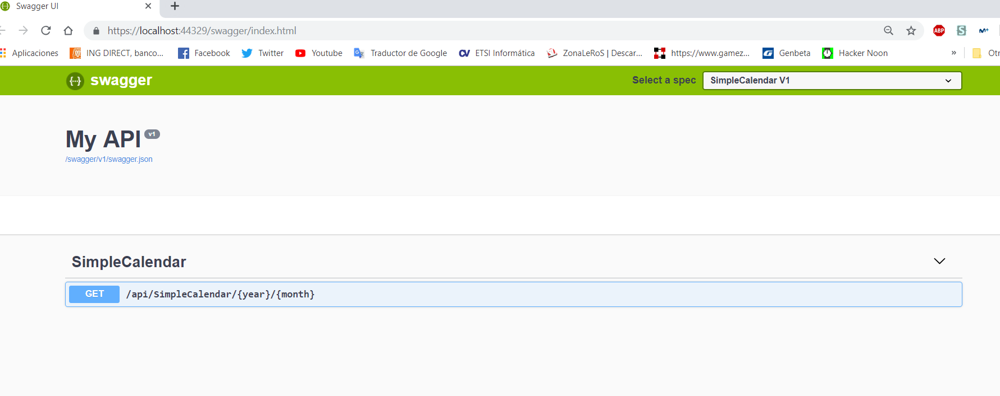

# SimpleCalendar.Back
### Develop by Jairo Blanco Aldao
### Made with Visual Studio 2019 
-----------------------------------------------------------------------------------------------------------

## 1.Introduction
This repository contains the Back-End part of the SimpleCalendar PoC. The API is in charge of calculate the days and days position (Monday, Thursday, etc) and get the weather data.

## 2. Implementation
Due to time reasons no exception control and Tests has been implemented. Also, due to the complexity of the data and algorithms I don't beleave that implement a logger, exception control and test was extricly necessary. 
### 2.1. Architecture
The solution follow a simple architecture:

* API: Contains the EndPoints and the startup 
* Abstracts: Contains all the interfaces and Dto (Data Transfer Object) used by the differents layers
* Core: Contains the logic of the API.

### 2.2. Code

The interest part of the code is the optimization of the services and configuration starup, which is implemented useing a IPartialStarup that must be implemented in each layer allowing each layer to declare itself.

IPartialStarup

```csharp
    /// <summary>
    /// Partial Startup to be registered with the service bootstrapping.
    /// </summary>
    public interface IPartialStartup
    {
        /// Registers the services of the library.
        /// </summary>
        /// <param name="services">Service collection to register the services into.</param>
        void RegisterServices(IServiceCollection services);
    }
```
Implementation example
```chsarp
    public class CorePartialStartup : IPartialStartup
    {
        /// <summary>
        /// Core services registration
        /// </summary>
        /// <param name="services"></param>
        public void RegisterServices(IServiceCollection services)
        {
            services.AddSingleton<ICalendarService, CalendarService>();
            services.AddSingleton<IOpenWeatherService, OpenWeatherService>();
        }
    }
```
Usage example (method include in the main startup of WebApi project)
```csharp
        protected void RegisterPartial<T>(IServiceCollection services) where T : IPartialStartup, new()
        {
            T partialStartup = new T();

            partialStartup.RegisterServices(services);
        }
```

To get the calendar data, first I declare a simple structure which contains an n number of weeks and each weeks contains a object Day compose by weather and day (number). The position of the days in the week array indicates the Week Day or position (Monday, Tuesday, etc)

```csharp
 public class CalendarData
    {
        public List<Week> Weeks { get; set; }
        public int ActualDayWeek { get; set; }
        public int ActualDayWeekPosition { get; set; }
    }

    public class Week
    {
        public Day[] Days { get; set; }
    }

    public class Day
    {
        public int WeekDay { get; set; }
        public string Weather { get; set; }
    }
```
To calculate the month days (Week day position and week (first week, second week, etc), I calculate the position of the first day of the month and them the last day. With this data I can calculate the position of each day.

```csharp
   public async Task<CalendarData> GetMonthDays(int year, int month)
        {
            //Set if is necessary set the day for weather information
            bool weatherInfoNeeded = DateTime.Now.Month == month && DateTime.Now.Year == year;

            DateTime firstMonthDay = new DateTime(year, month, 1);
            int lastMonthDay = DateTime.DaysInMonth(year, month);

            CalendarData data = new CalendarData() { Weeks = new List<Week>()};
            int weekDay = (int)firstMonthDay.DayOfWeek == 0 ? 7 : (int)firstMonthDay.DayOfWeek;

            Week week = new Week() { Days = new Day[7] };
            for (int i = 1; i <= lastMonthDay; i++)
            {
                if (weekDay > 7)
                {
                    weekDay = 1;
                    data.Weeks.Add(week);
                    week = new Week() { Days = new Day[7] };
                }

                week.Days[weekDay - 1] = new Day() { WeekDay = i };

                if (i == DateTime.Now.Day && weatherInfoNeeded)
                {
                    data.ActualDayWeek = data.Weeks.Count;
                    data.ActualDayWeekPosition = weekDay - 1;
                }

                weekDay++;
            }
            //Add last week
            data.Weeks.Add(week);

            if (weatherInfoNeeded)
            {
                data = await _openWeatherService.GetWeather(data);
            }

            return data;
        }
```

Get Weather is in fact really trivial, once you know how to parse date

```csharp
  private List<string> ParseResult(JToken openWeatherResponse)
        {
            var dateWeatherInformation = new List<string>();
            openWeatherResponse = openWeatherResponse.First;
            int day = DateTime.Now.Day;

            while (openWeatherResponse != null)
            {
                int responseDay = DateTime.Parse(openWeatherResponse["dt_txt"].ToString()).Day;

                if (responseDay == day || responseDay == day + 1)
                {
                    dateWeatherInformation.Add(FormatInfoFromResponse(openWeatherResponse));
                    // Necesary if API is called after 9 PM
                    day = responseDay;
                    day++;
                }

                openWeatherResponse = openWeatherResponse.Next;
            }

            return dateWeatherInformation;
        }


        private string FormatInfoFromResponse(JToken weatherInfo)
        {
            string weatherInfoFormated = "";

            weatherInfoFormated = weatherInfo["weather"].First["main"].ToString();
            weatherInfoFormated += $"({(int)weatherInfo["main"]["temp"]}ºC)";

            return weatherInfoFormated;
        }
```

## 3. How to try it?

* Clone the repository
* Open it with Visual Studio 2019
* Press Start

What should I get?:



## 4. Conclusions

I think that the aim of the exercise has been succesfully achieve, however, for time reasons I couldn't show some important skills as can be exception control, logging, testing, etc.
In fact, I hope the effort and dedication be considered as a plus and not as a handicap.
